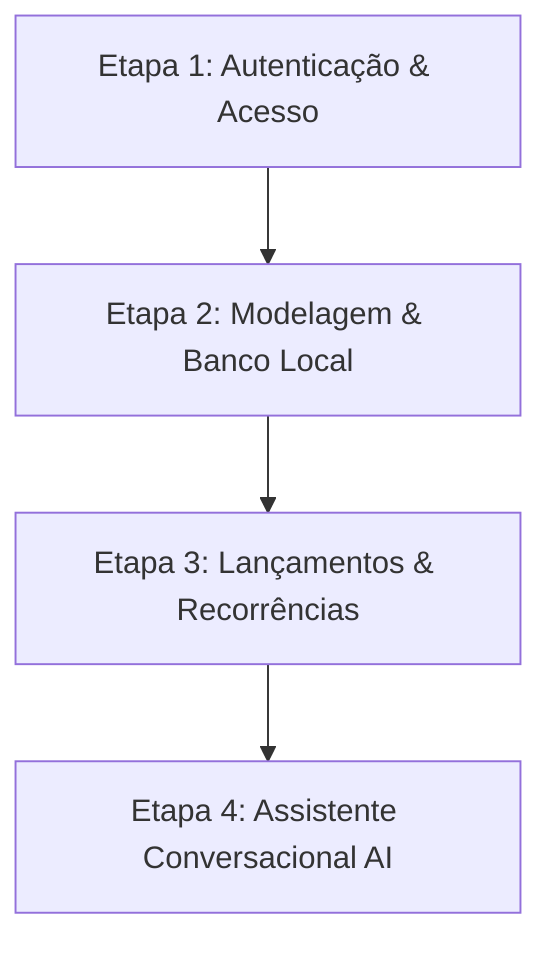

# 🌌 Fortunate — Direcionamento Estratégico & Roadmap

Este documento consolida a **visão conceitual (não técnica)**, as **diretrizes de design (Style Guide)** e o **cronograma de desenvolvimento** do Fortunate, servindo como guia único para o alinhamento de produto e engenharia.

---

## 🎨 1. Visão do Produto & Filosofia (Contexto Não Técnico)

O **Fortunate** não é apenas mais uma planilha financeira ou aplicativo de controle de gastos rígido. Ele foi desenhado para transformar a relação das pessoas com o dinheiro através de **clareza visual, física elástica e direcionamento inteligente de riqueza**.

### 🌟 A Metáfora Visual: O Céu Celestial
Inspirado na simbologia da prosperidade e clareza, o aplicativo utiliza a metáfora do **Céu Místico**:
* **O Fundo (O Céu):** Muda de cor de acordo com o tema selecionado (Céu Azul no Light mode, Noite Profunda no Dark mode, Crepúsculo no Dim mode).
* **Os Painéis (As Nuvens):** Painéis e cartões flutuam sobre o fundo utilizando **vidro líquido (Glassmorphic panels)**, transmitindo uma sensação de leveza e organização espacial.
* **O Brilho (O Ouro Fortuna):** A cor de acento dourada/laranja representa a iluminação solar, direcionando o olho do usuário para ações de crescimento e liberdade.

### 🏛️ Distribuição Proporcional por Pilares
Em vez de categorizações infinitas e punitivas, o Fortunate organiza a riqueza em **6 pilares estruturais de alocação**:
1. **Gastos Essenciais (50%):** Moradia, alimentação, saúde. A base de sustentação.
2. **Conforto:** Melhorias na qualidade de vida que trazem bem-estar diário.
3. **Prazeres:** Lazer, jantares, hobbies. O dinheiro aproveitado no presente.
4. **Conhecimento:** Cursos, livros, mentorias. O investimento no próprio potencial.
5. **Metas:** Projetos de médio prazo (viagens, compras planejadas).
6. **Liberdade Financeira (Investimento):** O dinheiro trabalhando para comprar a autonomia do futuro.

### 🏠 O Modelo de Casa Compartilhada (Householding)
O aplicativo foi desenhado para facilitar a vida financeira de casais e famílias:
* **Divisão Automática:** Despesas compartilhadas são divididas proporcionalmente com base na renda líquida de cada membro.
* **Membros Ativos vs. Perfis:** Uma "Casa" (Household) pode conter membros com login ativo (usuários do app) e membros passivos (perfis criados para registrar despesas e reembolsos).
* **Ausência de Atrito:** O split é calculated de forma justa em tempo real, sem necessidade de transferências manuais exaustivas de "divisão de contas".

### 🤖 Assistente AI Conversacional (Fortunate AI)
A interface possui uma barra de assistente flutuante inferior (ativável com `⌘K` ou toque). A IA atua como uma companheira de jornada:
* **Registro por Conversa:** O usuário escreve "Gastei R$ 45 no almoço hoje com Luche" e a IA classifica a transação, identifica o pilar e o atribui ao membro automaticamente.
* **Consultas Semânticas:** "Qual é o saldo da minha meta de Liberdade?" ou "Estou dentro do limite de Gastos Essenciais?".

---

## 📐 2. Diretrizes de Design Consolidadas (Design System)

Durante a fase de prototipagem do Style Guide, estabelecemos regras de design rígidas para garantir o requinte e a legibilidade da interface:

### 🔮 Regras de Vidro & Transparência
* **Glass Fino (12% de Opacidade, 8px Blur):** Usado apenas em containers estruturais secundários e painéis de fundo de grandes dimensões.
* **Glass Denso (70% de Opacidade, 12px Blur):** Usado em cartões menores, demonstrativos rápidos e elementos onde a leitura precisa ser rápida.
* **Vidro do Modal (80% de Opacidade, 12px Blur + 30% Light mix):** Diálogos flutuantes e modais utilizam uma mistura de 30% da cor de luz (`var(--c-light)`) para clarear o vidro. Isso impede que o vidro pareça cinzento ou escuro quando sobreposto ao backdrop escurecido.
* **⚠️ Proibição Crítica:** **Decks de cartões empilhados (Stacked Cards) nunca devem usar o Glass Fino (12%)**. O empilhamento de camadas transparentes funde os textos inferiores, destruindo a leitura. Decks empilhados devem usar obrigatoriamente **Glass Denso**.

### ⚡ Animações & Física Elástica
* **Formato de Cápsula (`border-radius: 999px`):** Todos os botões e seletores seguem o formato de pílula arredondada dos switchers de tema.
* **Física de Mola:** Botões ativos expandem ligeiramente (`scale(1.03)`) e sobem (`translateY(-2px)`) com curva cúbica de Bezier no hover, comprimindo-se (`scale(0.95)`) no clique.
* **Inputs Elevados (3D):** Campos de entrada de dados e dropdowns possuem bordas com reflexo de luz superior e sombras discretas para parecerem peças de vidro empilhadas físicas sobre o cartão de base.
* **Bloqueio de Scroll:** O scroll da página principal é congelado (`overflow: hidden` no body) sempre que um modal estiver aberto, prevenindo deslocamentos acidentais no plano de fundo.

---

## 🚀 3. Próximas Etapas (Roadmap de Desenvolvimento)

Dividiremos a construção do aplicativo em 4 etapas lógicas:

### 🔐 Etapa 1: Autenticação & Gestão de Acesso (Foco Imediato)
* **Objetivo:** Permitir o registro, login e a vinculação de membros em um mesmo núcleo familiar (Household).
* **Experiência do Usuário (Não Técnico):**
  * Página de Login e Cadastro premium seguindo o estilo visual de vidro leitoso.
  * Criação do perfil da "Casa" e convite de membros por e-mail.
* **Detalhes Técnicos:**
  * Configuração de rotas protegidas no Next.js (middleware).
  * Autenticação via NextAuth.js/Auth.js ou JWT em cookies seguros.

### 💾 Etapa 2: Modelagem de Dados & Conexão Local
* **Objetivo:** Implementar o banco de dados relacional local para salvar transações, carteiras e pilares definidos no styleguide.
* **Experiência do Usuário (Não Técnico):**
  * Salvamento automático instantâneo e funcionamento offline-first. As configurações de tema e dados persistem mesmo se o navegador for fechado.
* **Detalhes Técnicos:**
  * Arquivo SQLite local (`fortunate.db`) rodando no diretório do projeto.
  * Mapeamento de tabelas utilizando o **Drizzle ORM** (relacionamento estrito entre `households`, `users`, `pillars`, `categories` e `transactions`).
  * Migrações de banco automáticas integradas nos scripts do Nx workspace.

### 📝 Etapa 3: Gestão de Lançamentos & Recorrências
* **Objetivo:** Lançamento de despesas, receitas e transferências de forma manual através do modal leitoso interativo.
* **Experiência do Usuário (Não Técnico):**
  * Preenchimento rápido de novos lançamentos usando os inputs elevados 3D e seletor dropdown de pilar com seta customizada.
  * Opção de marcar lançamento como "recorrente" para repetição automática mensal.
  * Gráfico dinâmico atualizado em tempo real mostrando a distribuição atual dos pilares.
* **Detalhes Técnicos:**
  * API endpoints protegidos no Next.js (`/api/v1/transactions`, `/api/v1/recurrence-templates`).
  * Lógica de mutação de transações recorrentes (alterar apenas esta, alterar tudo, ou alterar daqui para frente).

### 🤖 Etapa 4: Integração com Assistente Conversacional (Fortunate AI)
* **Objetivo:** Habilitar o assistente inteligente no rodapé do aplicativo.
* **Experiência do Usuário (Não Técnico):**
  * Digitar comandos de linguagem natural na barra inferior (`⌘K`) para inserir dados sem preencher formulários, ou pedir resumos financeiros.
* **Detalhes Técnicos:**
  * Integração com SDK do Gemini Pro.
  * Desenvolvimento de prompts de sistema com JSON estruturado para extrair `description`, `amount`, `category` e `member` da fala do usuário e direcioná-los às rotas da API.
